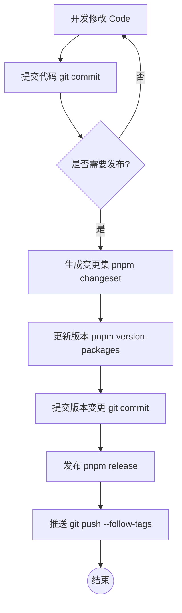

# Moonwind UI 开发与发布工作流指南

本文档详细说明了 Moonwind UI 项目的日常开发、代码提交、版本管理及发布部署的标准流程。

## 1. 💻 开发与修改 (Development)

在开始修改代码之前，请确保已安装依赖。

### 初始化
```bash
pnpm install
```

### 启动开发环境
*   **启动文档站点 (VitePress)**:
    用于编写和预览组件文档。
    ```bash
    pnpm dev
    ```

*   **启动组件开发预览 (Playground)**:
    用于快速调试组件功能。
    ```bash
    pnpm dev:playground
    ```

*   **启动 Storybook**:
    用于组件的独立开发和测试。
    ```bash
    pnpm storybook
    ```

### 代码规范检查
在提交前，建议运行 Lint 检查：
```bash
pnpm lint
pnpm type-check
```

---

## 2. 💾 提交代码 (Commit)

本项目强制使用 [Conventional Commits](https://www.conventionalcommits.org/) 规范。

### 提交格式
```
<type>(<scope>): <subject>
```

### 常用 Type
*   `feat`: 新功能 (feature)
*   `fix`: 修复 bug
*   `docs`: 文档变更
*   `style`: 代码格式 (不影响代码运行的变动)
*   `refactor`: 重构 (既不是新增功能也不是修改 bug 的代码变动)
*   `perf`: 性能优化
*   `test`: 增加测试
*   `chore`: 构建过程或辅助工具的变动

### 示例
```bash
git add .
git commit -m "feat(button): add ghost variant support"
git commit -m "fix(hooks): resolve memory leak in useClickOutside"
```
*注意：提交信息如果不符合规范，会被 Husky + Commitlint 拦截。*

---

## 3. 📦 版本管理 (Changeset)

当你的修改涉及到包的发布（即需要更新版本号）时，需要执行此步骤。**普通的开发提交不需要执行此步骤，只有在准备发布新版本时才需要。**

### 第一步：生成 Changeset
运行以下命令，交互式地生成变更记录：
```bash
pnpm changeset
```
1.  **选择包**: 使用空格键选择受影响的包（如 `moonwind-ui`, `@moonwind-ui/components` 等）。
2.  **选择版本类型**:
    *   `patch` (v1.0.0 -> v1.0.1): 修复 bug
    *   `minor` (v1.0.0 -> v1.1.0): 新功能（向后兼容）
    *   `major` (v1.0.0 -> v2.0.0): 破坏性更新
3.  **输入描述**: 简要描述变更内容，这将出现在 CHANGELOG 中。

完成后，`.changeset` 目录下会生成一个随机文件名的 Markdown 文件。

### 第二步：消耗 Changeset 并更新版本
当你准备好发布时（例如积累了几个 Changeset 后），运行：
```bash
pnpm version-packages
```
此命令会自动：
1.  读取 `.changeset` 目录下的文件。
2.  根据变更类型自动计算并更新各包的 `package.json` 版本号。
3.  更新各包的 `CHANGELOG.md`。
4.  删除已消耗的 Changeset 文件。

---

## 4. 🚀 构建与发布 (Build & Release)

在版本号更新完成后，即可进行构建和发布。

### 发布流程
```bash
# 1. 提交版本更新
git add .
git commit -m "chore: release v1.0.1"

# 2. 运行发布脚本 (包含构建和发布)
pnpm release
```

`pnpm release` 会依次执行：
1.  `pnpm build`: 构建所有包。
2.  `changeset publish`: 将更新后的包发布到 npm Registry，并根据配置打上 Git Tag。

### 推送到远程
发布完成后，别忘了将代码和 Tags 推送到远程仓库：
```bash
git push --follow-tags
```

---

## 5. 🌐 文档部署 (Deployment)

文档站点 (VitePress) 托管在 GitHub Pages 上。

### 自动部署
项目配置了 GitHub Actions (`.github/workflows/deploy-docs.yml`)。
*   **触发条件**: 当代码推送到 `master` 分支时。
*   **流程**: 自动安装依赖 -> 构建包 -> 构建文档 -> 部署到 GitHub Pages。

### 手动构建预览
如果你想在本地预览构建后的文档：
```bash
pnpm build:docs
pnpm preview:docs
```

---

## 📜 流程总结图


